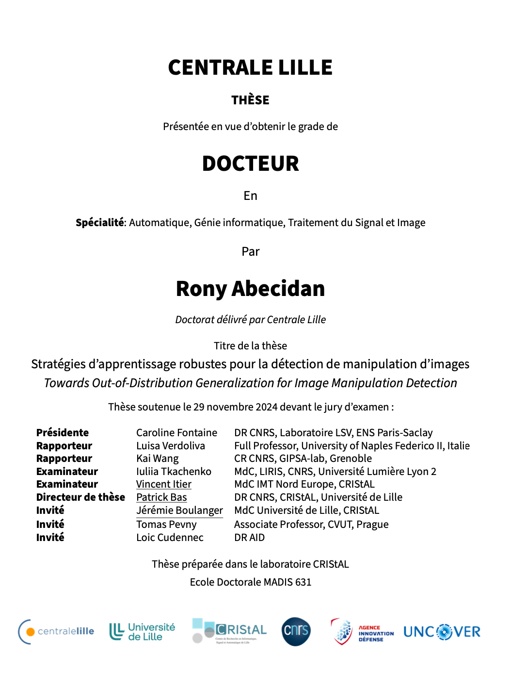

 

# Introduction

I share this template to inspire and encourage the creation of academic works that are both clear and visually appealing. Use it to bring your ideas to life and share your research with the world!

Click on my thesis cover to get a preview of what your thesis can look like with this template:

[](https://pdf2flip.forge.apps.education.fr/?p=2&m=0#https://theses.hal.science/tel-04886125v1/document)


---
Remark: The code is not perfectly clean and I am open to any suggestions or updates that would make this template even easier to use. Feel free to contribute or propose improvements!
---


## Installation

1. **Requirements:**
   - A recent LaTeX distribution (TeX Live, MikTeX, MacTeX, etc.)
   - Compile with `pdflatex` or `xelatex`.
2. **Required packages:**
   - Most packages are already included: `graphicx`, `lipsum`, `tikz`, `mwe`, `titlesec`, `enumitem`, `booktabs`, `fancyhdr`, `hyperref`, `caption`, `mdframed`, `amssymb`, `amsmath`, `amsthm`, etc.
   - To install missing packages, use your package manager (e.g., `tlmgr install <package-name>`).

## Usage

- **Structure:**
  - The main document is `main.tex`.
  - Chapters are in separate files (`chapter1.tex`, `chapter2.tex`, ...).
  - The style and structure are defined in `structure.tex`.
- **Sections and Subsections:**
  - Add sections with `\section{Title}` and subsections with `\subsection{Title}`.
  - Subsections are intentionally left empty for you to add your own content easily.
- **Placeholder Images:**
  - To insert a dummy image, use:
    ```latex
    \includegraphics[width=0.3\textwidth]{example-image-a}
    ```
  - Change the letter to vary the placeholder (`example-image-b`, etc.).
- **Custom Boxes and Environments:**
  - Use the following environments to highlight content:
    - `\begin{tBox} ... \end{tBox}`: main theorem/box
    - `\begin{dBox} ... \end{dBox}`: definition
    - `\begin{cBox} ... \end{cBox}`: corollary
    - `\begin{wBox} ... \end{wBox}`: warning
    - `\begin{waitBox} ... \end{waitBox}`: waiting
    - `\begin{alice} ... \end{alice}` and `\begin{eve} ... \end{eve}`: Alice/Eve pictograms
    - `\begin{idea} ... \end{idea}`: idea
    - `\begin{article} ... \end{article}`: article
    - `\begin{hypo} ... \end{hypo}`: hypothesis
- **Pictograms:**
  - The environments `eve`, `alice`, `warning`, `wait`, `hypo`, `article`, `idea` defined in  `structure.tex` automatically display an icon in the margin.

  **Note:** My thesis was related to cryptography, which explains the presence of the characters Alice (who wants to communicate secretly) and Eve (who intercepts Alice's messages) in the pictograms. However, you are free to invent your own characters to bring information from any particular point of view or to adapt the template to your own narrative style.

## Customization

### Colors
- Main colors are defined in `structure.tex` with `\definecolor`.
- To change the main text color:
  ```latex
  \definecolor{dark}{rgb}{0.06, 0.05, 0.03}
  \color{dark}
  ```
- To change title colors:
  ```latex
  \definecolor{darkblue}{HTML}{0096FF}
  % Change the HTML value
  ```
- To change box colors (theorems, definitions, etc.):
  - Edit the `backgroundcolor` and `linecolor` options in the environment definitions (`tBox`, `dBox`, etc.).
- To change chapter number colors:
  - Edit the `\color{darkblue!}` command in the Table of Contents section of `structure.tex`.
- To change pictogram:
  - Edit the icon files in the `figs/` folder.

### Fonts
- The template uses sans-serif (`\sffamily`) for titles and headers.
- To change the global font, add for example:
  ```latex
  \usepackage{helvet}
  \renewcommand{\familydefault}{\sfdefault}
  ```

### Section Styles
- Section, chapter, and subsection styles are customized via the `titlesec` package and `\renewcommand{\section}` etc. in `structure.tex`.
- Edit these commands to adjust size, color, or font of titles.

### Boxes and Environments
- Custom environments (`tBox`, `dBox`, etc.) are defined with the `mdframed` package.
- You can adjust margins, colors, rounded corners, etc. in `structure.tex`.

### Pictograms
- The `eve`, `alice`, etc. environments use TikZ to display an icon in the margin.
- To add new pictograms, create a new environment following the existing models.

## Credit

This template was created by **Rony Abecidan** to inspire and encourage the creation of more beautiful and educational academic works.

Licence : (CC BY-NC-SA 3.0)

## How to remove the credit footer

To remove the 'Template designed by Rony Abecidan' footer from  chapter 1 and chapter 2, simply delete or comment out the following lines in the corresponding `.tex` files:

- In `chapter1.tex` and `chapter2.tex`:
  ```latex
  \fancyfoot[C]{\small Template designed by Rony Abecidan}
  ```

---

Feel free to adapt this template to your needs and share your improvements!

---

N.B. : I started to design this template using this one [The Legrand Orange Book Template (English)](https://www.overleaf.com/latex/templates/the-legrand-orange-book-template-english/jtctyfmnpppc) by Mathias Legrand and Vel (CC BY-NC-SA 3.0).


You can also remove all occurrences of `\fancyfoot[C]{...}` or any custom `\fancypagestyle` that sets this footer.
